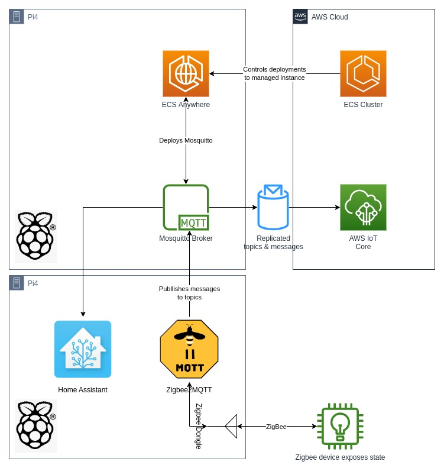

.. meta::
    :description: Mosquitto-on-edge
    :keywords: AWS, AWS ECS, docker-compose, iot, mosquitto

===========================================================
MQTT persistence with AWS IOT core bridge with Mosquitto
===========================================================

TL;DR
======

Using AWS IOT Core and Mosquitto, all local MQTT transactions are synchronized on AWS for persistence and future-proofing.

Background
===========

As a "homelab" person, and an AWS architect, it is sometimes very conflicting to want to go for an in-house solution
vs an in-the-cloud one.

I recently got myself into using non-wifi smart devices, namely using ZigBee, to control my lights, monitor the house
(climate control, door states, etc.). Naturally as a python and open-source dev, I got myself into using the excellent
`Home Assistant`_ which has an incredibly good set of integrations to a lot of devices, and allows users to define
automation/scripts and so on in a very user-friendly interface.

There are many different topologies one can adopt, and the one I chose is to have my ZigBee devices to link back to
`ZigBee2MQTT`_ which is a bridge/broker between the Zigbee coordinator and MQTT. It receives states messages from the
devices and publish messages to a MQTT server.

Googling around, I found an `AWS Blog Post`_ and also documentation relating to GreeGrass that would allow anyone to get
started with on-boarding devices which are local inside a network to publish to AWS IoT Core / Greengrass.

And so I started to test different setups

Implementation
================

Let's dive into the implementation and deployment of the solution.

Before we start though, here are a few things to know for future references

* `AWS ECS Anywhere`_
* `Mosquitto`_
* `MQTT`_
* `AWS IOT Core`_
* `ZigBee`_

Design overview
-----------------

I wanted most of all, to be able to keep things private and secure. But also, although there now are the excellent
AWS IAM Roles anywhere as an option, very few home applications support to use the SDK chain of credentials to
communicate with AWS, and expect to create IAM users, with an access key and secret key.

So instead, I decided to use `AWS ECS Anywhere`_: I use a Pi4 as an ECS instance in my cluster which is more than capable to
run a few containers, and because it uses ECS, it will be given a Task Role. That's how to get IAM credentials sorted.

And as usual, `ECS Compose-X`_ comes to "the rescue" in taking away all the complexity of configuring cloud resources,
and at the same time allow to test everything locally.

Configuration and deployment
===============================

Security
------------

Although in my home network I have different VLANs for different type of devices, I still wanted to use SSL over the
home network for everything related to smart devices, and so I provisioned a few SSL certificates using `Let's Encrypt`_.
That allows all the services internally to communicate over HTTPs without SSL errors all over the place, but that is not mandatory.

`ZigBee`_ also uses encryption for Over The Air (you might see it written OTA) communication. I won't go into the details
of it and will encourage to look into the documentation and RFC that describes that protocol.

As for secrets and other credentials like resources, they will be stored in `AWS Secrets Manager`_,.

AWS IoT core
^^^^^^^^^^^^^^

You could skip this step if you are not interested in using AWS IoT core and rely solely on your local storage for
messages, but for me AWS IoT is the place I want to persist, through bridging, the messages and topics. This opens
up tons of opportunities for future work as well.

If you do wish to use AWS IoT Core, then you will need to do a few things, most of which are documented in the `AWS Blog Post`_.

For this, I will shamelessly re-use these commands with a few tweaks.
Then we will store the certificates in Secrets Manager.

.. code-block::

    # I don't usually allow all actions for a service, but at that point, it's hard to figure out how to implement least privileges yet.
    # So I re-used the AWS team IoT policy.
    aws iot create-policy --policy-name bridgeMQTT --policy-document '{"Version": "2012-10-17","Statement": [{"Effect": "Allow","Action": "iot:*","Resource": "*"}]}'

    # Create a new folder to store our certificates into.
    mkdir iot_core; cd iot_core
    wget https://www.amazontrust.com/repository/AmazonRootCA1.pem -O rootCA.pem

    #Create certificates and keys. Make a note of the certificate ARN as it will be #needed to configure the IoT Policy.
    aws iot create-keys-and-certificate --set-as-active --certificate-pem-outfile cert.crt \
        --private-key-outfile private.key --public-key-outfile public.key

    #Copy the ARN of the certificate returned by the command line in the form of #arn:aws:iot:us-east-1:0123456789:cert/xyzxyz
    # and replace it in the following #command line in order to attach the IoT policy to your certificate
    aws iot attach-principal-policy --policy-name bridgeMQTT --principal <certificate ARN>

    #Add read permissions to the private key and the public certificate
    chmod 600 private.key
    chmod 644 cert.crt

Now we have the ``private.key`` and ``cert.crt`` files, we are going to store these in AWS S3.
This is for demonstration purposes, one could just equally store them in AWS Secrets Manager or other
secure and private locations.

To store the files, simply run the following commands

.. code-block::

    # from the `iot_core` folder still, run
    aws s3 sync . s3://my-secret-bucket-name/mqtt/mosquitto/

.. attention::

    Make sure you are storing these into a secure, non public bucket.

One could implement a renewal with a new certificate at each new container creation, but the implications of doing
that aren't clear at this point, so just following the least path of resistance. Also, that allows us to do all the
local testing needed.

Once this is done, the last thing we need from AWS IoT core is the endpoint URL. Just run the following command to retrieve
your account's endpoint.

.. code-block::

    aws iot describe-endpoint --endpoint-type iot:Data-ATS

Keep it handy, we will use it in the docker compose file in a little while.

Home-Assistant authentication
^^^^^^^^^^^^^^^^^^^^^^^^^^^^^^^

MQTT supports multiple ways to authenticate, one of which is a very simple username/password, very similar to basic
authentication you would for Apache2/NGINX web servers. Generate a new password file using the instructions documented
`in the official Mosquitto documentation <https://mosquitto.org/documentation/authentication-methods/>`_

For examples, we will assume that the Mosquitto secret file is called ``mosquitto_auth``

Once we have the file, we store it as-is in AWS Secrets Manager. We could also just equally store it into S3 with the
other files for this project.

.. code-block::

    aws secretsmanager create-secret --name iot/home/ha/mqtt --secret-string `cat mosquitto_auth`

Mosquitto configuration
------------------------

Alright, we have all the files and configuration, but where does that go ? We are going to use template files locally,
which using `Files Composer`_ we will be able to render at the time our containers get created. That avoids storing and
hardcoding values that will change based on environment, location and so forth. And keep things secret / secure at the
same time.

First, let's have a look at the bridge.conf.j2 file, which will be used by mosquitto to establish the mqtt bridge.

.. literalinclude:: ../../iot/mosquitto-on-edge/bridge.conf.j2

The main Mosquitto configuration

.. literalinclude:: ../../iot/mosquitto-on-edge/mosquitto.conf.j2

.. note::

    The content of these two file is copied into the ``mosquitto_bootstrap.yaml``,
    but kept the separate in this repository for convenience.

Deploy to ECS Anywhere
---------------------------

Final configuration file: mosquitto_bootstrap.yaml. This file is used by `Files Composer`_ to lay out all of the files
we want and need to get Mosquitto running properly. Let's have a look.

.. literalinclude:: ../../iot/mosquitto-on-edge/mosquitto_bootstrap.yaml

And we put everything together in docker-compose.yaml file

.. literalinclude:: ../../iot/mosquitto-on-edge/docker-compose.yaml

And now, to deploy, all we need to do is

.. code-block::

    # If compose-x is not yet installed on your machine
    python3 -m venv iot-venv
    source iot-venv/bin/activate
    pip install pip -U; pip install ecs-composex

    # Test the configuration and template rendering
    ecs-compose-x config -f docker-compose.yaml
    ecs-compose-x render -d templates -f docker-compose.yaml -p iot-mqtt-on-edge

    # Deploy
    ecs-compose-x up -d templates -f docker-compose.yaml -p iot-mqtt-on-edge

    # Destroy if you wish after testing
    # aws cloudformation delete-stack --stack-name iot-mqtt-on-edge

Looking back
==============================

Why not just use AWS IoT core + rules & Lambda ?
----------------------------------------------------

`Home Assistant`_ is very popular, just works, is open source, and cloud agnostic. And for many reasons I think it is
on of the very best projects out there. So yes, one could re-implement in the form of AWS IoT devices, rules with
AWS Lambda functions, a fair number of the functionalities implemented today in it.

But that would mean "re-inventing the wheel". And further to that, the consumer grade devices today aren't meat to
connect to AWS IoT directly. Using the MQTT broker to retain the MQTT messages and possibly tomorrow have more MQTT
brokers for distributed installations in different places, is an easy and safe way to repeat the process.

But what about costs?
-------------------------

The more devices, the more messages, the more messages, the higher the costs. At the start of the project I also
had configured `Mosquitto`_ to relay the messages in both ways, which doubled un-necessarily the costs. But we are
still talking about $1 to 2$ at the most.

Using AWS IoT core is a simple way for me to achieve multiple things:

* Have persistence of the messages
* Future proof and prepare for distributed locations
* Not rely on my local hardware.

At the moment for 20+ devices, all connected via Zigbee and MQTT to home-assistant, I pay a mere just about $4 a month.
A cost I am very happy to pay for privacy and piece of mind.

Home Assistant not connected to IoT core directly ?
----------------------------------------------------

Great question I hear, and there are two reasons.

The first one is, faced a few issues with the HA MQTT configuration, it just would not use my client certificates
to connect to IoT core. Something to dig into for future implementations I suppose.

But then also arose the second and to me, **the** reason to use a broker even in a multi-site deployment: having a local
MQTT broker, enables to work offline: if circumstances were to loose internet access, and therefore no access to AWS
IoT core, all my home automation, driven by Home Assistant, still works perfectly well.

Looking ahead
================

Not relying on local hardware for persistence
---------------------------------------------

This will be a repeating point in the IoT series. Using AWS ECS Anywhere and local hardware, namely Pis, NUCs etc.
is only a mean to an end, but as much as possible, the success criteria for me is to apply the same philosophy of
"cattles vs pets": yes, I need hardware to run the applications, but I need not to depend on it and be able to change
or replace it quickly from one host to another just like I would in using AWS Fargate.

Working on this project, the final goal evolved as I went, but generally speaking, it has been a lot of fun and
very much enjoyed learning new things, getting deeper into IoT and using `AWS ECS Anywhere`_ to establish persistence
in the cloud at low cost.

.. _Home Assistant: https://www.home-assistant.io/
.. _AWS ECS Anywhere: https://aws.amazon.com/ecs/anywhere/
.. _AWS IOT Core: https://aws.amazon.com/iot-core/
.. _Mosquitto: https://mosquitto.org/
.. _ZigBee2MQTT: https://www.zigbee2mqtt.io/
.. _MQTT: https://mqtt.org/
.. _AWS Blog Post: https://aws.amazon.com/blogs/iot/how-to-bridge-mosquitto-mqtt-broker-to-aws-iot/
.. _ZigBee: https://en.wikipedia.org/wiki/Zigbee
.. _ECS Compose-X: https://github.com/compose-x/ecs-composex
.. _Let's Encrypt: https://letsencrypt.org/
.. _AWS Secrets Manager: https://aws.amazon.com/secrets-manager/
.. _Files Composer: https://github.com/compose-x/ecs-files-composer
