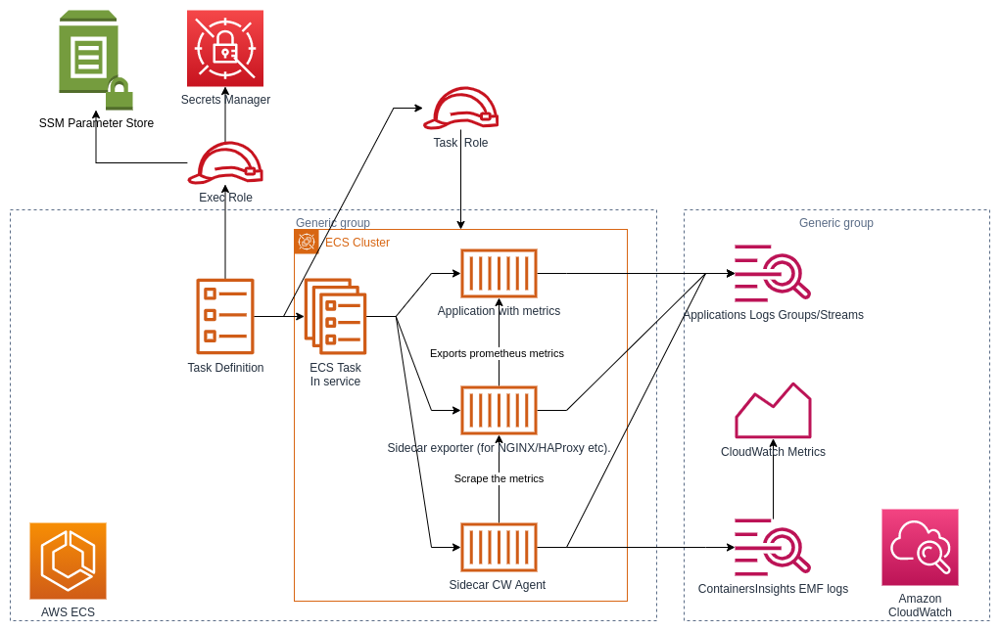

.. meta::
    :description: ECS Compose-X Labs
    :keywords: AWS, AWS ECS, Docker, Compose, docker-compose, kafka, connect, confluent, prometheus, cloudwatch

======================================
AWS ECS & CloudWatch with Prometheus
======================================

Intro
======

TLDR; AWS CloudWatch and Prometheus are awesome. (`Files and examples`_)

AWS CloudWatch is a service that is incredibly powerful, feature rich, and with the right settings, very cost efficient.
Collections of metrics, both system and business ones, is something that not everyone gets right. By using AWS CloudWatch
metrics, logs and dashboards, companies have been able to rely on that service to perform some mission critical operations.

But it is not always easy to get right, and some applications built out there were not built with any sort of plugin
that would allow export of application metrics easily.

In the monitoring world, Prometheus is a growing monitoring tool that is to be reckon with and AWS did not miss the mark on this.
People around the world decided to simply provide along with their applications, a Prometheus exporter and a sample configuration
file that instructs how to capture metrics, and how to format them.

It is incredibly efficient and most of the time the exporter are very lightweight, not clogging up the main application resources.

However, the question for a lot of AWS users out there is

**How do I get my prometheus captured metrics and funnel these into my AWS CloudWatch metrics?**

AWS CloudWatch EMF
=====================

AWS CloudWatch has a whole API suite to allow people to publish metrics into AWS CloudWatch, but not using these correctly
can lead to problems. The two major issues usually are

* API Blocking calls
* Increased AWS Bill (1 API call with 100 datapoints is 1 call.cost(), 100 API calls with 1 datapoint is 100x a call.cost()) for high volumetry.

Tinkering on these issues, AWS came up with `Enhanced Metrics Format`_ (EMF for short). Now, I won't go into the details
of how to use it in this blog post. The documentations and SDKs will take care of that.

What I want to focus on today is the question at hand

So, how do I capture these Prometheus metrics in AWS CloudWatch ?
====================================================================

Just a thought before jumping into this
-----------------------------------------

Why do I want my metrics from prometheus into AWS CloudWatch when there is `AWS AMP`_ ? What about NewRelic and all?

My answer to that is, do what works for you. If you are like me and use AWS CW for metric, logs, alarms, dashboards,
MLOps etc, or other AWS Services such as AWS Lambda, extracting Prometheus metrics and put them in AWS CloudWatch means
one less thing to manage and better integration to what you already have.

.. tip::

    If you do not like CW Dashboards, you can always visualize all these metrics in Grafana. Look at `Grafana on ECS`_
    to look at how we implemented this (because we could not use AWS managed grafana :/ )

The architecture of Prometheus Metrics export into AWS Container Insights
---------------------------------------------------------------------------

Let's implement this
---------------------

First, we need to check if we can use an exporter for our application. Not all applications will have an interface
that allows prometheus to scrape metrics. If you have applications that you build yourselves, SDKs will allow you to
natively expose these metrics.

But some applications though, you might have to use an exporter. For this blog post we will take a look at two of them:

* `NGINX Prometheus Exporter`_
* `Java JMX Exporter`_

NGINX implementation
=================================

NGINX is probably the reverse-proxy you think of when you hear "reverse-proxy". Alright, throw HAProxy in the mix too.
But for today, let's look at NGINX. NGINX has a special config setting that allows to export metrics that the
`NGINX Prometheus Exporter`_ will parse and expose in a Prometheus way.

.. tip::

    You can find NGINX Prometheus exporter on dockerhub, but if you are afraid of rate limiting, and you should be,
    `here are two published images for it. <https://gallery.ecr.aws/?verified=verified&searchTerm=nginx-prometheus-exporter>`__
    that I published on AWS ECR. (`Source Code <https://github.com/compose-x/nginx-prometheus-exporter>`__)

From the documentation, we know that all we need is that access to NGINX either on a specific *location* or in its own *server* section.
The exporter by default will expect to find the metrics on localhost:8080/ so to keep it simple, we will use a specific *server*.

Now, given that we already have a really good example of NGINX acting as a reverse-proxy with our `Kafdrop`_  use-case, let's
simply add to our configuration

.. code-block::

    worker_processes 1;

    events {
      worker_connections 1024;
    }

    http {
      upstream kafdrop {
        server 127.0.0.1:9000;
        keepalive 64;
      }
      # We add a new server to return our stub_status
      server {
        listen 8080;
        server_name _;
        location / {
            stub_status;
            access_log   off;
        }
      }
      server {
        listen 443 ssl;
        server_name _;
        ssl_certificate /etc/nginx/ssl/nginx.crt;
        ssl_certificate_key /etc/nginx/ssl/nginx.key;
        ssl_protocols TLSv1.2 TLSv1.3;
        ssl_ciphers ECDHE-RSA-AES256-GCM-SHA512:DHE-RSA-AES256-GCM-SHA512:ECDHE-RSA-AES256-GCM-SHA384:DHE-RSA-AES256-GCM-SHA384:ECDHE-RSA-AES256-SHA384;
        ssl_prefer_server_ciphers on;
        ssl_session_cache shared:SSL:10m;
        ssl_dhparam /etc/nginx/ssl/dhparam.pem;
        ssl_ecdh_curve secp384r1;
        location / {
          proxy_pass http://kafdrop;
          add_header Strict-Transport-Security "max-age=16156800; includeSubDomains" always;
        }
      }
    }

Now that was the easy part. But looking at the AWS Documentation on how to collect these metrics and have them set into
AWS CloudWatch, that looks like a rather large amount of work

* IAM permissions
* AWS CloudWatch agent sidecar configuration
* CloudWatch agent configuration
* Prometheus configuration
* etc.

And this is where `ECS Compose-X`_ comes into play and makes all of that complexity go away.
Just by adding a few lines in our service configuration, all of the above and all the little details are taken care of
for you.

So, re-using our NGINX service that was defined in our docker-compose file, we make the following changes.

.. code-block:: yaml

    services:
      nginx:
        ports:
        - 443:443
        - target: 9113 # We add a port in the task definition so docker exposes it. We do not need the publish port.
          protocol: tcp
        x-prometheus: # New section that allows to define our Prometheus settings
          ContainersInsights: # We specifically want to use AWS ECS ContainerInsights for this
            EnableCWAgentDebug: true # We are curious and want to check what's happening. Turn off when happy. Default is false
            CollectForNginx: # this tells compose-x that we want to auto configure everything needed for NGINX
              ExporterPort: 9113 # We specifically indicate the port our exporter wants. For NGINX, defaults to 9113
            AutoAddNginxPrometheusExporter: true # This tells ECS compose-x to automatically add the nginx prometheus exporter sidecar

And that is all you had to do! From now on, after NGINX started successfully, the exporter side car will start and export
metrics into a prometheus friendly format. Our cloudwatch sidecar container will therefore attempt to read and extract metrics.
With all the settings in place, you will start to see in CW Metrics, in the **ECS/ContainerInsights/Prometheus** Namespace.

.. tip::

    AWS has a prebuilt dashboard for NGINX Prometheus metrics to allow you to visualize these.

Kafka Connect implementation
==============================

Once again, re-using an existing use-case seen in this lab, Kafdrop and Kafka Connect are perfect examples to look at two
use-cases

* JAVA JMX Metrics that reflect metrics on how the JAVA application is doing. (both kafdrop and kafka connect)
* Collecting metrics available through custom export and ingest into AWS CW Metrics.

So first of, we need to tell our JAVA application to use the `jmx_prometheus_exporter`_ as a javaagent and give it a configuration
file that will instruct how to collect the JAVA "beans" and make these into metrics.

So for JAVA applications that only expose JMX metrics, such as our Kafdrop, once again, we can just stick the following configuration
in our compose file

.. code-block:: yaml

    services:
      kafdrop:
        image: public.ecr.aws/compose-x/amazoncorretto:11
        ports:
        - 9000:9000
        - target: 1234
          protocol: tcp
        x-prometheus:
          ContainersInsights:
            EnableCWAgentDebug: true
            CollectForJavaJmx:
              ExporterPort: 1234
        labels:
          job: jmx_prometheus_export
          jmx_prometheus_export: "true"

.. hint::

    The `CollectForJavaJmx`_ has predefined metrics collection, as defined in `these AWS Docs pages`_

But let's go into details using Kafka connect.

First off, we need the exporter and the config. You can have these added to your docker image, or you could have these
imported from S3/Urls etc. using `files-composer`_

In this case, I will stick to pulling it externally. This has the advantage of allowing me to reload the config if I change
it so I do not have to rebuild the image due to a **non mission critical config**.

So here is my files-composer service configuration

.. code-block:: yaml

    services:
     connect-files:
        environment:
          ENV: dev
          ECS_CONFIG_CONTENT: |

            files:
              /opt/connect/jmx_exporter.jar:
                source:
                  Url:
                    Url: https://repo1.maven.org/maven2/io/prometheus/jmx/jmx_prometheus_javaagent/0.16.1/jmx_prometheus_javaagent-0.16.1.jar
                mode: 644
                owner: 1001
                group: 1001
              /opt/connect/kafka_connect.yaml:
                source:
                  Url:
                    Url: https://raw.githubusercontent.com/compose-x/compose-x-labs/study/prometheus/kafka/confluent-kafka-connect/prometheus/kafka_connect.yml
                mode: 644

.. tip::

    There are a few good jmx exporter configuration in GitHub. Here I modified one provided by Confluent.

But what about the custom metrics
------------------------------------

.. attention::

    Now, depending on how many connectors your connect cluster might be running, you might get **thousands** of metrics.
    So pay attention to the following configuration underneath not to get a billing surcharge due to metrics.

Aside from the usual JMX Metrics that we get Kafka connect provides us with thousands of metrics. Which ones are important
to you are down to you.

In my case I kept the prometheus configuration as-is, exporting more metrics than I need, in this blog post.
But in production, **reducing the amount** of metrics you scrape for, can lead to performance improvements.

.. tip::

    When using compose-x for these side-car deployments, all of them get strict CPU and memory limits to ensure
    your core application is not impacted.

So, I use kafka connect and I want only a few metrics about my connectors. How do I tell the CW Agent to focus on these
only?

ECS Compose-X Allows you to create your own custom rules for metrics collection. So for connect, I configured as follows

.. code-block:: yaml

    services:
      connect:
        secrets:
          - CONNECT_CREDS # My Kafka secrets defined in the secrets section of my compose file
        ports:
          - "8083:8083"
          - target: 1234 # I add the port I tell jmx exporter to expose the metrics on
            protocol: tcp
        deploy:
          replicas: 3
          resources:
            limits:
              cpus: "2.0"
              memory: "4G"
        x-scaling:
          Range: "3-6"
          TargetScaling:
            MemoryTarget: 75
        x-alarms:
          Predefined:
            HighCpuUsageAndMaxScaledOut:
              Topics:
                - x-sns: connect-alarms
              Settings:
                CPUUtilization: 85
                RunningTaskCount: 6
                Period: 60
                EvaluationPeriods: 15
                DatapointsToAlarm: 5
            HighRamUsageAndMaxScaledOut:
              Topics:
                - x-sns: connect-alarms
              Settings:
                MemoryUtilization: 80
                RunningTaskCount: 6
                Period: 60
                EvaluationPeriods: 15
                DatapointsToAlarm: 5
        x-network:
          UseCloudmap: True # Automatically registers my connect nodes in DNS and service discovery
          Ingress:
            Myself: True # Allows to open the SG ports to the service own security group
        x-iam:
          Policies:
            - PolicyName: AssumeRoles
              PolicyDocument:
                Version: "2012-10-17"
                Statement:
                  - Effect: Allow
                    Action:
                      - sts:AssumeRole
                    Resource:
                      - arn:aws:iam::000000000000:role/role-for-cross-account-connectors
        x-prometheus:
          ContainersInsights:
            EnableCWAgentDebug: true
            CollectForJavaJmx:
              ExporterPort: 1234
              source_labels:
                - container_name
              label_matcher: "^connect.*$"

            # We define some private rules.
            CustomRules:
              - ExporterPort: 1234  # The exporter is the same as the JMX one, I just add new scrapping config.
                EmfProcessors:
                  - source_labels:
                      - container_name
                    label_matcher: "^connect$" # I match the container named connect
                    dimensions:
                      - ["ClusterName", "TaskDefinitionFamily", "connector", "task"]
                    metric_selectors:
                      - "^kafka_connect_connector_task_metrics_batch_size_avg$"
                      - "^kafka_connect_connector_task_metrics_batch_size_max$"
                      - "^kafka_connect_sink_task_metrics_offset_commit_completion_rate$"
                      - "^kafka_connect_sink_task_metrics_offset_commit_completion_total$"
                  - source_labels:
                      - container_name
                    label_matcher: "^connect$"
                    dimensions:
                      - ["ClusterName", "TaskDefinitionFamily", "connector"]
                    metric_selectors:
                      - "^kafka_connect_connect_worker_metrics_connector_(?:total|failed|unassigned|paused|running)_task_count$"

        labels:
          container_name: connect
        environment:
          EXTRA_ARGS: -javaagent:/opt/connect/jmx_exporter.jar=1234:/opt/connect/kafka_connect.yaml

But how does this get into CloudWatch then?
-----------------------------------------------

I am glad you asked. With all this configuration, what ECS Compose-X is going to do is

* Generate the Prometheus scraping configuration, and load it into AWS SSM Parameter
* Generate the EMF Processors for NGINX/Java/AppMesh, whichever predefined ones are set
* Add the EMF configuration from the Custom Rules that you have defined
* Generate the CW Agent configuration content that is needed by the agent into a SSM Parameter
* Add the cloudwatch agent as a sidecar to the task definition
* Configure IAM access to AWS Logs, ECS etc.

From there, once deployed, our CW Agent sidecar will

* Ingest the SSM configurations and render them into something it understands
* Perform services discovery on ECS services based on the services names and Task definitions etc.
* Match the configuration and docker labels of these to the ones it is configured to scrape
* Ingest Prometheus metrics from the various exporters, and transform the metric from a prometheus format to an EMF format
* Buffer up the metrics until publishing them into Containers Insights
* These get picked up by AWS CW That creates metrics for us automatically

And that is where understanding how EMF works helps with configuring our ingestion rules properly.

So let's see in detail how we get our kafka connect metrics from the rules defined above.

Let's explain the Custom Rules
-------------------------------

First, let's look at what a prometheus metric with one of the regular expression looks like

.. code-block:: shell

    curl -s connect.dev.internal:1234/ | grep -E "^kafka_connect_connect_worker_metrics_connector_(?:total|failed|unassigned|paused|running)_task_count$"

    kafka_connect_connect_worker_metrics_connector_total_task_count{connector="sink.connectora.v1",} 1.0
    kafka_connect_connect_worker_metrics_connector_total_task_count{connector="sink.connectorb.v1",} 2.0
    kafka_connect_connect_worker_metrics_connector_total_task_count{connector="sink.connectorc.v1",} 2.0

    curl -s connect.dev.internal:1234/ | grep kafka_connect_sink_task_metrics_offset_commit_completion_total

    kafka_connect_sink_task_metrics_offset_commit_completion_total{connector="sink.connectora.v1",task="0",} 1455.0
    kafka_connect_sink_task_metrics_offset_commit_completion_total{connector="sink.connectorb.v1",task="0",} 201.0
    kafka_connect_sink_task_metrics_offset_commit_completion_total{connector="sink.connectorc.v1",task="1",} 1454.0

So we notice that the metric, which are `gauge`_ type, have different labels. That is down to the exporter configuration.
Again, this is something that you can decide on your own.

.. code-block:: yaml

    rules:
      - pattern: "kafka.connect<type=connect-worker-metrics, connector=(.+)><>([^:]+)"
        name: kafka_connect_connect_worker_metrics_$2
        labels:
          connector: $1
        type: GAUGE

      - pattern: "kafka.connect<type=(.+)-task-metrics, connector=(.+), task=(\\d+)><>(.+): (.+)"
        name: kafka_connect_$1_task_metrics_$4
        labels:
          connector: "$2"
          task: "$3"
        type: GAUGE

Alright, so this tells us about the values we can use for `dimensions`_

For the first rule, we have

* ClusterName [ECS]
* TaskDefinitionFamily [ECS]
* connector [from the gauge labels content)

For the second one, we could use

* ClusterName [ECS]
* TaskDefinitionFamily [ECS]
* connector [from the gauge labels content)
* task [from the gauge labels content]

.. hint::

    The task ID might not be a big deal, so you could just remove the label in prometheus, or in dimensions

.. attention::

    If in the the dimensions list you indicate, one is not actually available, **none of the metrics** will be ingested
    in the CW Metrics. You can however look into AWS CW Logs for these JSON formatted payload which will tell you
    what keys could be used for dimensions.

So that is how we end up with these EMF Processor rules

.. code-block:: yaml

    EmfProcessors:
      - source_labels:
          - container_name
        label_matcher: "^connect$" # I match the container named connect
        dimensions:
          - [ "ClusterName", "TaskDefinitionFamily", "connector", "task" ]
        metric_selectors:
          - "^kafka_connect_connector_task_metrics_batch_size_avg$"
          - "^kafka_connect_connector_task_metrics_batch_size_max$"
          - "^kafka_connect_sink_task_metrics_offset_commit_completion_rate$"
          - "^kafka_connect_sink_task_metrics_offset_commit_completion_total$"
      - source_labels:
          - container_name
        label_matcher: "^connect$"
        dimensions:
          - [ "ClusterName", "TaskDefinitionFamily", "connector" ]
        metric_selectors:
          - "^kafka_connect_connect_worker_metrics_connector_(?:total|failed|unassigned|paused|running)_task_count$"

Conclusion
===========

This example is the perfect reflection of enabling an application that is not cloud aware (implements an interface to the
cloud vendor native APIs) and still ingest available metrics into AWS CloudWatch metrics to keep your services
integration for monitoring and alerting.

AWS CloudWatch agent handles all the conversion to EMF for you in this case, but you could do that yourself using
`EMF SDKs`_

.. tip::

    Bonus point for such central services that you might be managing centrally in one AWS Account: AWS CloudWatch
    now supports alarms with metrics from other accounts. So if you had a lot of metrics coming out of a shared
    system that other accounts in your business might want to have, that is now possible, instead of publishing these
    multiple times.

.. hint::

    From EMF formatted logs, you could also create your own Clouwatch Logs Insights queries or Athena Queries (etc.)
    to perform some more complex aggregations and parsing.

A note for the cloud agnostic fans out there
----------------------------------------------

If you are a software vendor and you want to build an application that is cloud capable but not cloud aware and not implement
AWS specific interfaces to publish metrics, this mechanism gives you a way out, simply by providing examples of configurations,
for existing exporters or your own, or implement Prometheus metrics so we can scrape them and we AWS users can ingest
them easily.

.. _ECS Compose-X: https://docs.compose-x.io
.. _AWS AMP: https://aws.amazon.com/prometheus/
.. _CollectForJavaJmx: https://docs.compose-x.io/syntax/compose_x/ecs.details/prometheus.html#collectforjavajmx
.. _dimensions: https://docs.aws.amazon.com/AmazonCloudWatch/latest/monitoring/cloudwatch_concepts.html#Dimension
.. _EMF SDKs: https://docs.aws.amazon.com/AmazonCloudWatch/latest/monitoring/CloudWatch_Embedded_Metric_Format_Libraries.html
.. _Enhanced Metrics Format: https://docs.aws.amazon.com/AmazonCloudWatch/latest/monitoring/CloudWatch_Embedded_Metric_Format.html
.. _files-composer: https://ecs-files-composer.compose-x.io
.. _Files and examples: https://github.com/compose-x/compose-x-labs
.. _gauge: https://prometheus.io/docs/concepts/metric_types/#gauge
.. _Grafana on ECS: https://labs.compose-x.io/apps/grafana.html
.. _Java JMX Exporter: https://github.com/compose-x/jmx_exporter
.. _jmx_prometheus_exporter: https://github.com/compose-x/jmx_exporter
.. _Kafdrop: https://labs.compose-x.io/kafka/kafdrop.html
.. _NGINX Prometheus Exporter: https://github.com/compose-x/nginx-prometheus-exporter
.. _these AWS Docs pages: https://docs.aws.amazon.com/AmazonCloudWatch/latest/monitoring/ContainerInsights-Prometheus-Sample-Workloads-ECS-javajmx.html
