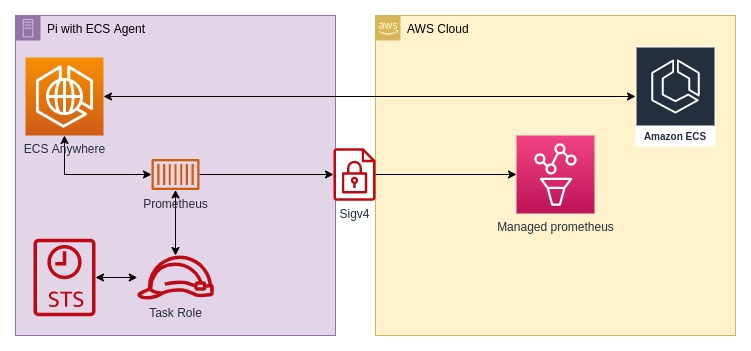

.. meta::
    :description: ECS Compose-X Labs
    :keywords: prometheus, observability, aws ecs, docker-compose

################################################
Prometheus proxy to AWS Managed Prometheus
################################################

TL;DR
======

Running Prometheus with proxy to AWS Managed Prometheus allows you to collect metrics with no requirement for local
storage. And using `AWS ECS Anywhere`_ along with `ECS Compose-X`_, makes it superbly easy.

.. note::

    ECS Compose-X version used: `0.22.6`_ (forward compatible)

.. hint::

    Although the shortcode for the Prometheus is AMP, the IAM permissions however use ``aps`` for domain.

Background
===========

Having worked with AWS for close to a decade, arguably, even more, I have always been fond of using "only" AWS
services. They naturally integrate, it's very secure, all of them supporting IAM for authentication.

But during all these years, I also worked a lot with hardware deployments: Eucalyptus, CEPH clusters, VMWare, and so on,
running in datacenters or simply at home for my own needs. So I got to test and use all the open source monitoring
solutions out there, and to me there never was anything better than `Zabbix`_. And this in my mind hasn't changed.

Rather, I evolved. The "cloud" in its larger sense brought up challenges that were answered with fantastic new open source projects.
And prometheus is one of them. And with the rise of `OpenTelemetry`_, most modern and cloud-native software today support to
expose metrics on their own, ready to be collected.

In my IoT series, and more generally with `AWS ECS Anywhere`_, I wanted then to monitor all the things I could,
but yet again without storing anything on my local storage nodes. I want to persist the metrics, externally, and at cost.

Design solution
=======================

As always when it comes down to architecture, there are hundreds of ways to do this. So, today we are only going to look
into the one solution, and I will go over why that's my choice for this use case.

So, the solution from 1000 miles out, is very simple:

Prometheus
-------------

Being a predominant project in the domain, I always had been playing around with it, but again, I try as much as possible
not to rely on local storage for storing data that I don't need to. So I was delighted when AWS created a managed service
for it.

The use of it on my end is still very new, so I can't quite yet talk of the costs associated, but given the number of
metrics published, I estimated that I will not go over the free tier for quite a while.

Plus, in a recent version, Prometheus added SignatureV4 as part of the core authentication, meaning one does not need
the sigv4 proxy anymore for "remote_write". Even better.

So from a security point of view, all I need to grant the ECS Task is permission to write to the APS workspace.

Deployment
============

The Amazon Managed Prometheus (AMP) workspace
-------------------------------------------------

First of all, we need to create a new (or you can use an existing) APS workspace. It is very
simple:

.. code-block::

    WORKSPACE_ID=`aws amp create-workspace | jq -r .workspaceId`

or simply head to the `AMP Service console`_ in your AWS account. From there, we need only the remote URL for the
Prometheus configuration.

Take note of the region and the workspace ID.

Prometheus configuration
----------------------------

As done in many other projects, I much prefer to use docker volumes and a configuration loader that will allow me to use the vendor's original docker image rather than build and maintain the docker images myself. Therefore, we are going to prepare the configuration file for Prometheus and use `Files Composer`_ to feed the configuration at runtime.

This has the added value of only requiring the task to restart instead of rebuilding an image for each typo that I make.

Let's have a look at the files-composer configuration file for a very basic and simple Prometheus remote write.

.. literalinclude:: ../../monitoring/prometheus-proxy-to-aps/prometheus-init.yaml

Very simple, and in future articles, we will go further and a lot more useful use-cases. For now, we are keeping this
very simple to get started.

Docker Compose
----------------

This might be one of the simplest, most bare docker-compose file I have used to deploy a service in ECS Anywhere.

.. literalinclude:: ../../monitoring/prometheus-proxy-to-aps/docker-compose.yaml

So now, to deploy to AWS, all we have to do is run the following commands

.. code-block::

    # Optional - verifies the integrity and correctness of the configuration.
    ecs-compose-x config -f docker-compose.yaml
    ecs-compose-x render -d templates -p testing -f docker-compose.yaml

    # Deploy
    export AWS_DEFAULT_REGION=<your region>
    # If you did not create a new workspace earlier, set the value now
    # export WORKSPACE_ID=<the workspace id>
    ecs-compose-x up -d templates -p testing -f docker-compose.yaml

Now, automatically all metrics collected by the scraping jobs will be written into AWS Prometheus

Looking back
===============

This is a very light, very easy example to get started and demonstrate how it would be very easy to integrate remote
systems monitoring and centralize that onto AWS, allowing for many different use-cases to come out of it.

One downside though, coming from the world of Zabbix or again AWS CloudWatch, where metrics are pushed by the application
to the monitoring system, is that by nature, Prometheus requires to be told what and how to scrape resources.

Also, systems such as Zabbix have decades of experience and a large community and resources that will allow people to
monitor their on-premise equipment: auto-discovery, SNMP, and so on, that just work and are highly configurable.
Not to mention the community-built templates that allow very easy and quick onboarding of existing and non-cloudy equipment.

Equally, you need to place an ``exporter`` service to run alongside "the thing you want to monitor", which will expose metrics into a format that the scraping jobs will be able to ingest, otherwise, you are not going to
get any metrics out of it. Thankfully there are more and more exporters available, along with many applications built in the cloud catching up and naturally exposing metrics in a Prometheus format, simply by enabling it.

Looking ahead
===============

In a future article, we will implement much more useful scraping jobs and integrations with other services to illustrate the potential and scalability of this solution. This is simply a step forward towards getting observability over services and infrastructure.

The wealth of tools and services available is almost overwhelming, and it will come down to the interoperability of these,
along with your goals and requirements, to choose the ones that match all your needs.

.. _AWS ECS Anywhere: https://aws.amazon.com/ecs/anywhere/
.. _ECS Compose-X: https://github.com/compose-x/ecs_composex
.. _OpenTelemetry: https://opentelemetry.io/
.. _Zabbix: https://www.zabbix.com/
.. _0.22.6: https://github.com/compose-x/ecs_composex/releases/tag/v0.22.6
.. _AMP Service console: https://eu-west-1.console.aws.amazon.com/prometheus/home?region=eu-west-1#/workspaces
.. _Files Composer: https://github.com/compose-x/ecs-files-composer
