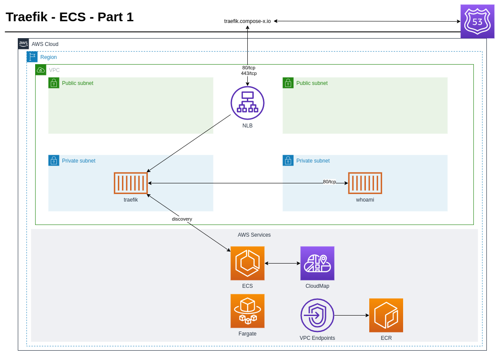
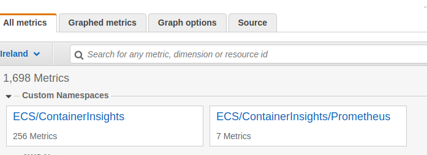
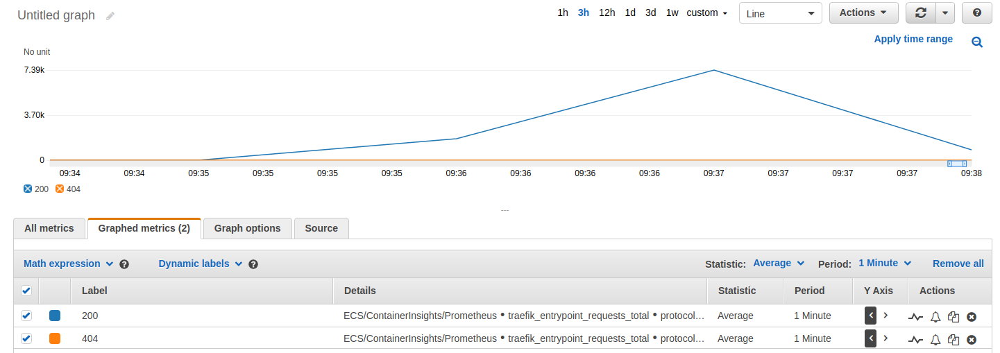

.. meta::
    :description: Compose-X Labs - Traefik part 1
    :keywords: AWS, docker, compose, Traefik, ECS

===========================================
Traefik Proxy in AWS with AWS ECS - Part 1
===========================================

TLDR; Traefik is easy to work with locally and in ECS, making it a great match for numerous use-cases. `Post source code`_

.. note::

    To follow the following with `ECS Compose-X`_ make sure to use version 0.18 or above.

Installation of ECS Compose-X
===============================

.. code-block:: bash

    python3 -m venv venv
    source venv/bin/activate
    pip install "ecs_composex>=0.18.0"

Introduction
===============

Today we are not trying to solve any particular challenge. As a request coming from the `Slack Community Channel`_,
someone is looking at deploying to AWS on ECS (with Fargate as compute layer) and have as little management overhead as
possible. And `ECS Compose-X`_ can help with just that.

In the `Summary`_ we will have a few take away points to see how Traefik might help us and how it might fit in the AWS
landscape.

What is `Traefik`_?
--------------------

From their GitHub Repository:

.. pull-quote::

    Traefik (pronounced traffic) is a modern HTTP reverse proxy and load balancer that makes deploying microservices easy.
    Traefik integrates with your existing infrastructure components (Docker, Swarm mode, Kubernetes,
    Marathon, Consul, Etcd, Rancher, Amazon ECS, ...) and configures itself automatically and dynamically.
    Pointing Traefik at your orchestrator should be the only configuration step you need.

They have 4 different offers as per their marketing site, but today we are only going to look into `Traefik proxy`_.

Traefik Proxy has a native integration into `AWS ECS`_, which makes it a perfect use-case candidate to work locally
on how it works, and set a different configuration that we will use in AWS, using `ECS Compose-X`_.

Let's dive in !
==================

For today, we are going to keep the use-case very simple as for Part 1, in our journey to using `Traefik`_.

Architecture for today's walk-through
-------------------------------------

Very simple architecture, we have a VPC, public and private subnets to deploy our resources into.
Our NLB will be public facing to make some tests, our application containers in ECS running in private networks.
Route53 and CloudMap will handle DNS for us, whilst ACM handles providing us with a SSL certificate that we use on the
TLS listener of our NLB.

Getting started
---------------------

So naturally, the first step is to read the documentation, and the `Traefik`_ docs team has done a really good job at explaining
how to make it work.

As expected, we find `this documentation on using it with docker-compose`_. That shall be our starting point.

.. note::

    The files you see in this blog post are the final versions that made it all work, instead of making this page
    twice as long with all the incremental changes made to the files.

Now, we are going to make some syntax changes, but nothing that make any real change to how docker/docker-compose will behave.

Namely we transforms the labels from a list of **key=value** to an object. The rationale is, this will ensure you do not
have any duplicate values that you might miss. It is also a lot clearer to see the values when using `override files`_

.. hint::

    We cannot however change the command list, so mind the options used carefully.

To make it easy to switch between local changes and ones that we make for AWS, we will use the docker-compose file
from the Traefik example as our local override file.

We end up with our docker-compose file

.. literalinclude:: ../../traefik/part_1/docker-compose.yaml
    :language: yaml

and our local override file

.. literalinclude:: ../../traefik/part_1/docker-compose.local.yaml
    :language: yaml

So what do you get doing docker-compose up with these two files?

.. code-block:: bash

    # Skip if you already have installed docker-compose and ecs-composex

    python -m venv venv
    source venv/bin/activate
    pip install pip -U
    pip install docker-compose ecs-composex>=0.16.4

    # Now for starting traefik and our small app

    (venv) [john@john-workstation part_1]$ docker-compose -f docker-compose.yaml -f docker-compose.local.yaml up -d

    Creating traefik        ... done
    Creating simple-service ... done
    (venv) [john@john-workstation part_1]$ docker-compose ps
    WARNING: The following deploy sub-keys are not supported and have been ignored: resources.reservations.cpus
    WARNING: The following deploy sub-keys are not supported and have been ignored: resources.reservations.cpus
         Name                   Command               State                                     Ports
    ------------------------------------------------------------------------------------------------------------------------------------
    simple-service   /whoami                          Up      80/tcp
    traefik          /entrypoint.sh --api.insec ...   Up      0.0.0.0:80->80/tcp,:::80->80/tcp, 0.0.0.0:8080->8080/tcp,:::8080->8080/tcp

    curl localhost/
    Hostname: 098f93b188dc
    IP: 127.0.0.1
    IP: 172.26.0.2
    RemoteAddr: 172.26.0.3:51678
    GET / HTTP/1.1
    Host: localhost
    User-Agent: curl/7.71.1
    Accept: */*
    Accept-Encoding: gzip
    X-Forwarded-For: 172.27.0.1
    X-Forwarded-Host: localhost
    X-Forwarded-Port: 80
    X-Forwarded-Proto: http
    X-Forwarded-Server: 3b063bcec1e5
    X-Real-Ip: 172.27.0.1

Okay, this is working, everything seems good to go. Now, let's move onto ECS.

From local to AWS using `ECS Compose-X`_
========================================

So we know how the configuration for traefik works when running on a machine with docker and privileged access.
But in AWS ECS, and especially in `AWS Fargate`_ (as opposed do `AWS EC2`_) we do not need nor want our container
to have elevated access to the daemon. Given that locally the discovery relies on docker, we need a way to make that
discovery work in AWS.

Fear not, Traefik as mentioned before has a very well `documented integration into AWS ECS`_.

Traefik needs API Access to ECS in order to perform queries and identify which other services deployed in AWS ECS
it should be sending traffic to when the labels are matching etc.

Changes to the services configuration
--------------------------------------

So first we change the commands to instruct traefik to use ECS and not docker for discovery.

.. literalinclude:: ../../traefik/part_1/aws.yaml
    :lines: 4-22
    :language: yaml

So first we add the IAM permission.

.. literalinclude:: ../../traefik/part_1/aws.yaml
    :lines: 23-46
    :language: yaml

.. tip::

    Later on we use AWS CW and Prometheus monitoring, policies to access the clusters are added from there too.
    You can use one or the other or both, but you need the ECS services discovery.

For our test service, we need to make one major adjustment: the port (80) for our local testing is not exposed to the host,
only to the internal docker network, because we used **expose** instead of **ports**. This is a very useful feature
that avoids exposing services on your machine and for testing, somewhat simulates a multi-tier network.

So we change the **expose** to **ports** and set a couple more things:

* We add the service in AWS CloudMap that will help us later on with the mesh (via x-network.UseCloudmap)
* We indicate that we allow ingress from the **traefik** service (via x-network.Ingress.Services[])
* We change the label **traefik.http.routers.whoami.rule** value to a real hostname we want to use.

.. literalinclude:: ../../traefik/part_1/aws.yaml
    :lines: 56-71
    :language: yaml

Definitions for AWS Specifically
------------------------------------

Alright, so now we have make changes to deploy our services in AWS.
For this demo, we won't be using an existing VPC but if you wish to do so, you can. Simply use `x-vpc.Lookup`_

.. attention::

    If you use an existing VPC, make sure to adapt the argument
    **- "--entryPoints.web.proxyProtocol.trustedIPs=100.64.72.0/24"**
    and only set the subnet mask of either your VPC or Public Subnets (where the NLB will be deployed).

ECS Cluster
++++++++++++++

We however are going to create a new ECS Cluster, which we will set the name in the environment variable **CLUSTER_NAME**.

.. hint::

    For this demo, my cluster name CLUSTER_NAME=traefik-demo

.. literalinclude:: ../../traefik/part_1/aws.yaml
    :lines: 73-87
    :language: yaml

DNS with Route53 and CloudMap
+++++++++++++++++++++++++++++++++

Now, for DNS. DNS will play as always a key role. Given we have a new VPC, we let compose-x create an interal domain
for AWS CloudMap. But, for the public domain, I am re-using the *compose-x.io* domain. Instead of having to know the
ZoneID etc, I simply request that ecs-compose-x performs a Lookup in my DNS zones.

We also create a new DNS entry, **traefik.compose-x.io** that will be automatically assigned to point to our NLB, via
**Target: x-elbv2::public-ingress**.

.. literalinclude:: ../../traefik/part_1/aws.yaml
    :lines: 89-99
    :language: yaml

Using a Load Balancer and ACM for SSL
++++++++++++++++++++++++++++++++++++++

Now onto the ingress itself, with a Load Balancer. Here, Traefik will do the requests parsing etc. so I am letting Traefik
to handle the HTTP "work" (later on this in the `Summary`_)

To showcase TLS termination on an NLB (supported since 2019) I created in advance an ACM certificate (created separately
but could have created with the stack too. Did that to avoid hitting ACM monthly quotas).

So we Lookup the certificate in ACM first.

.. literalinclude:: ../../traefik/part_1/aws.yaml
    :lines: 101-105
    :language: yaml

.. hint::

    If you do not want to deal with TLS, just remove/comment the part x-acm section above and remove/modify the
    Listener using port 443

    .. literalinclude:: ../../traefik/part_1/aws.yaml
        :lines: 120-126
        :language: yaml

.. literalinclude:: ../../traefik/part_1/aws.yaml
    :lines: 107-138
    :language: yaml

.. attention::

    As per the `Traefik Proxy Protocol documentation`_, when setting up behind a Load Balancer, one want to use one
    that supports Proxy Protocol. So we enable it on our NLB for our service target.

    .. literalinclude:: ../../traefik/part_1/aws.yaml
        :lines: 132-138
        :language: yaml

.. note::

    Because we are only deploying 1 container, to avoid issues and complexity, the NLB is allowed to send traffic
    across AZs. Disable that if not wanted or in production setup where you want to save on traffic costs.

Bonus section (optional)
----------------------------

A great feature from Traefik: support for exposing Prometheus metrics, built-in! So let's tap in that to capture some
interesting metrics locally and also capture them in AWS CloudWatch so that we can define smarter alarms and/or scaling.

Firs, let's check what metrics we can tap into

.. code-block:: bash

    curl -s localhost:8080/metrics | egrep '(HELP|TYPE)'

    # Picked one metric I want to get values from

    curl -s localhost:8080/metrics | grep "traefik_entrypoint_requests_total"
    # HELP traefik_entrypoint_requests_total How many HTTP requests processed on an entrypoint, partitioned by status code, protocol, and method.
    # TYPE traefik_entrypoint_requests_total counter
    traefik_entrypoint_requests_total{code="200",entrypoint="traefik",method="GET",protocol="http"} 6
    traefik_entrypoint_requests_total{code="200",entrypoint="web",method="GET",protocol="http"} 1
    traefik_entrypoint_requests_total{code="404",entrypoint="web",method="GET",protocol="http"} 1518

Alright, so as seen in `AWS ECS & CloudWatch with Prometheus`_ I simply have to define some configuration to extract
these metrics out of Traefik into AWS CloudWatch.

.. literalinclude:: ../../traefik/part_1/prometheus-to-cw.yaml
    :language: yaml

To AWS!
============

Deployment
---------------

Everything is ready to go. Make sure to log-in to your AWS Account, and we are ready to go.

.. code-block:: bash

    # Allows to ensure your account has the expected settings enabled for ECS and creates a S3 bucket to store
    # CFN Templates.
    AWS_PROFILE=<your profile> ecs-compose-x init
    # If using aws-vault
    # aws-vault exec composex -- ecs-compose-x init

    # To change the bucket to use, simply indicate -b/--bucket-name, if need be

    AWS_PROFILE=<your profile> CLUSTER_NAME=traefik-demo ecs-compose-x up -d outputs/ -n demo-traefik \
    -f docker-compose.yaml -f aws.yaml -f prometheus-to-cw.yaml

Verification and testing
--------------------------

Once the stack is all successfully started / created, we should be able to query our endpoint. In my case,
**traefik.compose-x.io**. So I run the following and wait for a reply

.. code-block:: console

    watch -d -n 1 curl -s http://traefik.compose-x.io/

Given that everyting is up and running, I get

.. code-block:: bash

    Hostname: ip-100-64-72-13.eu-west-1.compute.internal
    IP: 127.0.0.1
    IP: ::1
    IP: 169.254.172.2
    IP: fe80::b04f:a6ff:fe9e:8cc0
    IP: 100.64.72.13
    IP: fe80::848:87ff:fe2b:d119
    RemoteAddr: 100.64.72.23:54840
    GET / HTTP/1.1
    Host: traefik.compose-x.io
    User-Agent: curl/7.71.1
    Accept: */*
    Accept-Encoding: gzip
    X-Forwarded-For: 45.86.201.20
    X-Forwarded-Host: traefik.compose-x.io
    X-Forwarded-Port: 80
    X-Forwarded-Proto: http
    X-Forwarded-Server: ip-100-64-72-23.eu-west-1.compute.internal
    X-Real-Ip: 45.86.201.20

.. hint::

    X-Real-Ip: 45.86.201.20 # Yes, my real IP ... through VPN so not really me ;)

Okay, let's poke the bear.. gently though.

.. code-block:: console

    for x in {1..5}; do  ab -n 2000 -c 200 https://traefik.compose-x.io/; sleep 10; done # We create some "traffic"
    ab -n 10000 -c 100 https://traefik.compose-x.io/ # We create a spike
    for x in {1..5}; do  ab -n 2000 -c 200 https://traefik.compose-x.io/; sleep 10; done # We create some "traffic"

Is there a point at doing this you might ask ? Well, yes, for one thing: let's get some metrics out.
If everything worked properly with our settings in the **prometheus-to-cw.yaml** extension/override file, we should
see a new Metric Namespace in AWS CloudWatch.

Navigating into it, we find and select our metrics that relate to our "web" entrypoint, and look at some the HTTP codes counts
we get. As we can see, no errors, and the count spiked up during AB, before going back down towards the end of it.

.. note::

    Your mileage may vary in values based on your own connection if running these from your machine.

Summary
=========

So we proved that very simply with just some configuration **and no code change** we can run an application locally
and deploy it to AWS ECS. In this case, our NLB load-balances traffic to our Traefik instance and handles TLS for us too,
saving on CPU cycles.

This is a very simple and basic use-case using Traefik but we will cover more in Part 2!

Could have used an ALB ?
-------------------------

Yes. Given the use-case at hand, if you intend to use Traefik as a smart reverse proxy that will forward requests to
your application based on HTTP "information" (hostname, path, headers, combination of the above) then an ALB does
the job of our NLB + Traefik. Not to mention integration features such as Cognito and OIDC management.

.. seealso::

    `Grafana with ALB and Cognito + AzureAD`_

What will Part 2 cover?
---------------------------

In part 2 we will add autoscaling, more services reusing the same backend service application, but using different
topologies and adding a Service Mesh.

.. _Post source code: https://github.com/compose-x/compose-x-labs
.. _ECS Compose-X: https://docs.compose-x.io
.. _Traefik: https://github.com/traefik/traefik
.. _Traefik mesh: https://traefik.io/traefik-mesh/
.. _Traefik proxy: https://traefik.io/traefik-mesh/
.. _AWS ECS: https://aws.amazon.com/ecs
.. _AWS CloudMap: https://aws.amazon.com/cloud-map/
.. _AWS AppMesh: https://aws.amazon.com/app-mesh/
.. _this documentation on using it with docker-compose: https://doc.traefik.io/traefik/user-guides/docker-compose/basic-example/
.. _override files: https://docs.docker.com/compose/extends/#multiple-compose-files
.. _AWS Fargate:
.. _AWS EC2:
.. _documented integration into AWS ECS: https://doc.traefik.io/traefik/providers/ecs/
.. _x-vpc.Lookup: https://docs.compose-x.io/syntax/compose_x/vpc.html#lookup
.. _Traefik Proxy Protocol documentation: https://doc.traefik.io/traefik/routing/entrypoints/#proxyprotocol
.. _AWS ECS & CloudWatch with Prometheus: https://labs.compose-x.io/monitoring/ecs-containers-insights-prometheus.html
.. _Grafana with ALB and Cognito + AzureAD: https://labs.compose-x.io/apps/grafana.html
.. _Slack Community Channel: https://join.slack.com/t/compose-x/shared_invite/zt-uihmlsiq-sVyYHOQBnSBFctS5~PUHzw
