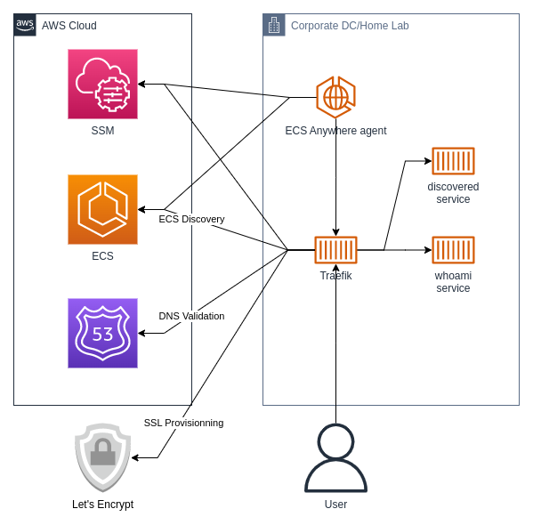
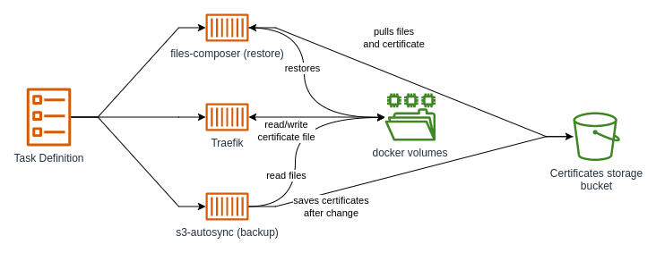

.. meta::
    :description: Compose-X Labs - Traefik part 2
    :keywords: AWS, docker, compose, Traefik, ECS Anywhere

===========================================
Traefik Proxy in AWS with AWS ECS - Part 2
===========================================

TL;DR
======

I believe that ECS Anywhere is the natural evolution to docker swarm for AWS applications on-premise.
Using Traefik with ECS Anywhere to deploy applications, might just make you feel like you are on AWS.
And ECS Compose-X makes the whole process even easier.

Introduction
==============

In the previous lab article, we went over deploying `Traefik`_ to AWS ECS and running it in AWS Fargate,
behind a Network Load Balancer (NLB). We used AWS Certificate Manager (ACM) to provision and terminate SSL connectivity with clients.

This time, we are going to deploy Traefik into `AWS ECS Anywhere`_ and use the TLS encryption management done by Traefik
with **Let's Encrypt** in order to provision certificates. **With a backup!**

What is AWS ECS Anywhere ?
============================

AWS ECS is the control plane service that allows you to create your Task Definitions, Service definitions, scheduled
tasks, etc., and deploy these into clusters.

The clusters rely on either a `Capacity Provider`_ such as AWS Fargate or AWS EC2 to provide the IaaS layers (compute,
networking, storage ,etc.) to run your containers into.

AWS ECS Anywhere is an extension of the ECS Capacity Providers which allows you to register on-premise ECS Instances.
These can be bare-metal machines, Virtual Machines, or using `AWS Outposts`_. You only pay per running ECS instance,
per month, but can deploy an unlimited set of containers (within your hardware capacity limits).

How does it work ?
----------------------

Without going into details, as many already covered this very well in `other blog posts`_. In a nutshell, your
machine (virtual or physical) is registered in AWS SSM, then your machine is registered into an AWS Cluster as an
ECS Instance.

Later we will go over a brief checklist of things to have in place to provide remote access as here Traefik will be the entry point into other services.

.. attention::

    As mentioned earlier, the installation of the necessary software and tools is out of the scope of this article.
    Proceeding forward, we assume that you have already gotten one or more working ECS Anywhere instances running.

The architecture
=================

The architecture is rather straightforward. We have an ECS Instance running on-premise, for me, on a RaspberryPi 4.
We installed docker onto it and ran the ECS Anywhere install scripts, and we are ready to go

If you list your container instances, you can now see yours. Here is mine

.. code-block::

    aws ecs list-container-instances --cluster ANewCluster
    {
        "containerInstanceArns": [
            "arn:aws:ecs:eu-west-1:373709687835:container-instance/ANewCluster/dfc804e50f7f445f9fbe3fae775997a6"
        ]
    }

.. note::

    If you plan to have ECS Instances running with an ARM processor, such as a RaspberryPi, make sure that the image
    you will use is either a list that contains ARM images, or that the image you pick was built for it.

Services deployment
============================

The basics
-------------

Using the docker-compose file from part 1, we make a few adjustments, most importantly, we set a deploy label
``ecs.compute.platform`` to ``EXTERNAL``. As a result, ECS Compose-X will set all the right properties and values
for this ECS Service to run with ECS Anywhere. Most importantly, it enforces in the configuration, the
`considerations when using ECS Anywhere`_

We also add to the ``command`` list, the Traefik option to use the ECSAnywhere provider.

.. code-block::

    - "--providers.ecs.ecsAnywhere=true"

In order to allow for that to work, we also need to add a few IAM permissions granted to Traefik to perform the services discovery.

In our ``ecs-anywhere.yaml`` extension file, we add policies to allow for

* SSM discovery - allows to find the ECS Instance details (IP Address etc.)
* Route53 - that will allow Traefik to use Route53 for certificates domain based validation.

.. literalinclude:: ../../traefik/part_2/ecs-anywhere.yaml
    :lines: 80-140

.. note::

    If you'd prefer to use HTTPs/TLS based certificate validations, change the settings,
    but you will need to publicly expose your application to the internet.

And that's it, you can now deploy Traefik with ECS Anywhere service discovery! From Part 1, along with TLS definitions,
that's very much the only difference/change that we have made. Of course, on-premise, we do not have a NLB either.

.. code-block::

    # Change the Cluster name to yours
    CLUSTER_NAME=ANewCluster ecs-compose-x up -d templates -f docker-compose.yaml -f ecs-anywhere.yaml

Backup and restore the SSL Certificates
-----------------------------------------

Why do we need to do that?
^^^^^^^^^^^^^^^^^^^^^^^^^^^

The reason we want to backup that file, is so that Traefik on restart finds the file and does not make requests
to Let's Encrypt over and over again, which could go above the quota/rate limit, and it wouldn't be able to retrieve
the certificates anymore.

This step is not strictly necessary, but if you are using ECS Anywhere on a local hard drive, or on AWS Fargate, the SSL
certificates file is not stored on a persistent/shared file system. And we want to avoid that as much as possible.

And unless you have configured a distributed/network file system such as NFS or AWS `Elastic File System`_, you will
need to implement the logic for persistent backup.

Implementation Logic
^^^^^^^^^^^^^^^^^^^^^

We are going to create 2 sidecars along with our Traefik container:

* the first one will attempt to restore/set configuration and the SSL certificates file **before** Traefik starts.
* the second one will be running alongside Traefik and watch for changes to the ``acme.json`` file.

The very first time, without the ``acme.json`` file stored in S3, there won't be anything to restore. So Traefik will
create the ``acme.json`` file. The watchdog container will pick the file up when changes occur, and store to S3.
In the event that Traefik has to generate a new certificate, the watchdog will pick it up again, create a backup of
the previous file, and store the new one.

The next time Traefik restarts (configuration change, failure of any kind, etc.), the ``traefik-restore`` container will find
the ``acme.json`` file in S3, and write it on the shared docker volume with Traefik. That way, Traefik already has
all the previous certificates it generated, and won't generate them again. Saving yourself from the Let's Encrypt
rate limiting.

Chronologically we have

* ``traefik-restore`` container starts, pulls and writes our ``acme.json`` container. If successful, stops and exits with success.
* ``traefik`` container starts, loads up configuration, and the ``acme.json`` certificates file.
* ``traefik-backup`` starts, and looks for any changes to the ``acme.json`` certificate file, and uploads to S3 upon changes to the file.

Implementation with Compose
^^^^^^^^^^^^^^^^^^^^^^^^^^^^^^

We create another extension file (but you could also make the changes in the existing ones!).
We add two more volumes:

* one shared to all 3 containers, that's where our ``acme.json`` file will be stored.
* one only shared between the restore and backup container

The ``traefik-restore`` container not only will restore the ``acme.json`` file, but it will also be giving instructions to the
backup container on how to perform the backup.

Now, let's look at these two containers more closely.

Let's look at ``traefik-restore`` first

.. literalinclude:: ../../traefik/part_2/backup.yaml
    :lines: 17-33

To instruct on what to do, we have the file ``restore_backup.yaml`` which is stored (base64 encoded) into a SSM parameter,
used by ``files-composer``. In the ``command`` section, we indicated that container to use the SSM parameter defined
in `x-ssm`_

.. literalinclude:: ../../traefik/part_2/backup.yaml
    :lines: 62-74

We mount the volumes that will restore the ``acme.json`` file for Traefik, and the volume for the backup container
to know which files to look for, and where to store them in S3.

Next, we have ``traefik-backup``, which shares a volume with our ``traefik`` container, to pick up on the file changes
made to ``acme.json``.

.. literalinclude:: ../../traefik/part_2/backup.yaml
    :lines: 35-58

We've added `x-s3 <https://docs.compose-x.io/syntax/compose_x/s3.html>`_ to lookup the existing S3 bucket that we want to use to store our files into.
The Traefik task IAM role will be granted RW access to the objects, and read-only on the bucket.

To deploy we simply now run

.. code-block::

    # Change the Cluster name to yours
    CLUSTER_NAME=ANewCluster ecs-compose-x up -d templates -f docker-compose.yaml -f ecs-anywhere.yaml -f backup.yaml

Summary
=========

We have now gotten ourselves a very easy way to deploy services using ECS Anywhere into our on-premise hardware.
But we also now have done it, with only a few changes compared to deploying the services to AWS Fargate.

ECS Compose-X automatically set all of the necessary options and properties to make our service run in either environment,
simply by changing configuration & labels.

And with Traefik having so many great features, and ECS Anywhere Services discovery, we can add services and applications,
and Traefik will automatically do the necessary to make it all work.

.. note::

    The example files in this repository are near identical to the configuration I have for my own home lab,
    and have since been able to add further services managed with Traefik simply by setting my labels correctly.

.. seealso::

    This has been delayed for a long time waiting on PRs to be merged to fix the ECS Anywhere integration with Traefik.
    Thanks to the Traefik team and `tuxpower`_ for working on this feature.

.. _AWS ECS Anywhere: https://aws.amazon.com/ecs/anywhere/
.. _AWS Outposts: https://aws.amazon.com/outposts/
.. _Capacity Provider:https://docs.aws.amazon.com/AmazonECS/latest/developerguide/cluster-capacity-providers.html
.. _other blog posts: https://aws.amazon.com/blogs/aws/getting-started-with-amazon-ecs-anywhere-now-generally-available/
.. _Traefik: https://github.com/traefik/traefik
.. _tuxpower: https://github.com/tuxpower
.. _Elastic File System: https://aws.amazon.com/efs/
.. _x-ssm: https://docs.compose-x.io/syntax/compose_x/ssm_parameter.html
.. _EKS Anyhere Pricing: https://aws.amazon.com/eks/eks-anywhere/pricing/
.. _ECS Anywhere Pricing: https://aws.amazon.com/ecs/anywhere/pricing/
.. _considerations when using ECS Anywhere: https://docs.aws.amazon.com/AmazonECS/latest/developerguide/ecs-anywhere.html#ecs-anywhere-considerations
